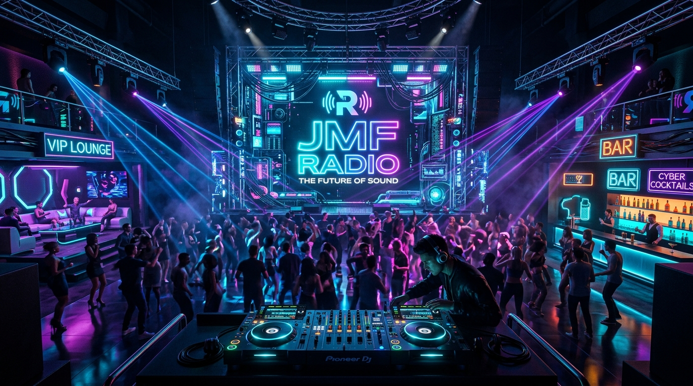

<div align="center">

# 🎧 JMF RADIO ● 3D VIRTUAL DJ & NIGHTCLUB

**An interactive 3D WebGL Nightclub & 24/7 DJ Streaming Station powered by Three.js, Blender 5.2, Web Audio API, and Node.js.**

[](LICENSE)
[](https://vitejs.dev/)
[](https://threejs.org/)
[](https://nodejs.org/)
[](https://www.blender.org/)
[](https://cloudflare.com/)

<br/>



<br/>

[**Live Demo**](https://remake-landfall-riches.ngrok-free.dev) • [**Features**](#-key-features) • [**Quick Start**](#-quick-start) • [**Architecture**](#-architecture) • [**Deployment**](#-deployment-options)

</div>

---

## 🌟 Overview

**JMF Radio** transforms any local music collection into a cybernetic, audio-reactive 3D nightclub experience. It combines a hardware-faithful **Pioneer CDJ-3000 & DJM-900NXS2 dual-deck workstation**, a minimalist **Radio Mode Console**, and an interactive **Three.js 3D venue** with animated characters, procedural lighting, and global streaming capabilities.

---

## 🎛️ Key Features

### 1. 🎧 Dual-Deck Pioneer CDJ-3000 & DJM-900NXS2 Hardware Station
* **Hardware Web Audio FX Unit**: Dedicated Web Audio DSP graph per deck (`Filter → Delay → Feedback Loop → Wet/Dry Mix`):
  * **ECHO**: 3/8-beat synced delay with club decay feedback.
  * **FLANGER**: Short comb-delay phase modulation.
  * **REVERB**: Dense spatial slapback room decay.
  * **FILTER**: Resonant lowpass/highpass sweep.
  * **Tactile Potentiometers**: Metallic rotary knobs for `LPF` cutoff, `RES` feedback/Q, `DRY/WET` blend, and `ON` toggle.
* **Authentic Pioneer CUE Mechanics**: Standard CDJ behavior — sets cue point at playhead when paused; pauses and instantly rewinds to cue point when playing.
* **8 RGB Hot Cue Performance Pads**: Instant playback markers on Decks A & B (Click: Jump to cue, `Shift + Click`: Set cue marker).
* **Interactive Vinyl Scratching**: 360° angular vinyl scratching with authentic 33 RPM physics, audio scrubbing, and mouse wheel pitch nudging ($\pm0.35\text{s}$).
* **Seamless DJ Auto-Crossfader**: Automatic 8-second club transitions with bass-swapping and interactive `CH 1` / `CH 2` quick-transition triggers.
* **16-Segment Segmented LED Meters**: Real-time channel and master stereo level meters responding dynamically to frequency analysis.
* **Dual Live Canvas Waveforms**: Real-time waveform rendering with smooth progress tracking, seeking, and remaining time calculation.

### 2. 📻 Minimalist Radio Mode Console
* **Clean Distraction-Free UI**: Tailored for background listening and mobile devices.
* **5 Web Audio Equalizer Presets**: `FLAT`, `BASS BOOST`, `CLUB`, `VOCAL`, and `ELECTRONIC`.
* **Hardware VU & Headphones Dials**: Rotary illuminated dials for master and headphones volume.
* **Smart Device Detection**: Automatically defaults to Radio Mode on smartphones and tablets.

### 3. 🔒 Broadcast Protection & VIP Resident DJ Booth
* **Host / Guest Security**: Configure `DJ_PASSWORD` in `.env` to restrict broadcast mutating endpoints (`/api/next`, `/api/skip`, `/api/prev`, `/api/genre/select`, `/api/rescan`).
* **VIP Club Modal**: Replaces raw 403 HTTP errors with a cyberpunk resident DJ modal guiding guests to request DJ access or enter their key.
* **Persistent DJ Auth**: Supports `?dj_key=...` URL parameter and `localStorage` caching for seamless mobile DJ control.

### 4. 🕺 3D Audio-Reactive WebGL Nightclub (Three.js + Blender 5.2 LTS)
* **Animated DJ Character**: Real-time head-bobbing, torso groove swaying, and beat-synced scratching postures.
* **JMF Cocktail Bar & Bartender**: Modeled bartender in vest and bowtie actively shaking cocktail shakers to the music's rhythm.
* **Sound System**: Double 18-inch subwoofer stacks with bass-reactive physical cone displacement.
* **Lighting & Rigging**: Parametric quad aluminum trusses with moving-head scanner beam lasers and a faceted chrome mirror disco ball.
* **8 Camera Director Presets**: `🎧 DJ Focus`, `👀 DJ POV` (1st-person view behind decks), `🕺 Dance Floor`, `🍸 Bar Lounge`, `👑 VIP Lounge`, `🎛️ Decks`, `🛋️ Full Club`, `🛸 Cinema Cam`.

### 5. 💡 Real-Time Club Lighting & Visual FX Controller
* **4 Color Palettes**: `🔵 Cyberpunk Neon`, `🌅 Sunset Lo-Fi`, `🟢 Emerald Matrix`, `🟣 Electric Blue`.
* **Dynamic FX Toggles**:
  - `⚡ Bass Strobe Flash`: Dynamic white strobing on heavy kick/bass drops.
  - `🛸 Moving Head Lasers`: Motorized scanner beam sweep spotlights.
  - `🌫️ Volumetric Club Fog`: Atmospheric haze particle simulation.
* **Intensity & Speed Sliders**: Adjust overall brightness (30%–250%) and laser sweep speed (0.3x–3.0x).

### 6. 📱 Fully Responsive Touch Architecture & PWA
* **PWA Ready**: Web App Manifest with full offline asset caching and standalone app install support.
* **Mobile Deck Tabs**: Dedicated `[ DECK A ]` | `[ MIXER ]` | `[ DECK B ]` switcher for compact screens.
* **Landscape Mode**: Automatic 3-column dual-deck hardware view on landscape mobile devices.
* **Keyboard Shortcuts**: `Spacebar` (Global Play/Pause) and `Escape` (Close all drawers/modals).

---

## 🏗️ Architecture

```
┌────────────────────────────────────────────────────────┐
│               Local PC Backend (Node.js)               │
│  - Scans local audio library (MUSIC_DIR)               │
│  - Zero-dependency .env loader & config manager        │
│  - Metadata & ID3 tag parser (music-metadata)          │
│  - In-memory Cover Art LRU Cache (200 tracks)          │
│  - DJ Authentication middleware (DJ_PASSWORD)          │
│  - AutoDJ 24/7 infinite playlist & queue engine        │
│  - HTTP 206 Partial Content range audio streaming      │
└──────────────────────────┬─────────────────────────────┘
                           │ Stream & Status REST APIs
                           ▼
┌────────────────────────────────────────────────────────┐
│            3D Frontend (Three.js + Web Audio API)      │
│  - AudioEngine: Delay/Feedback/Filter Hardware FX Graph│
│  - Three.js Scene: DJ Character, Bartender, Rigging   │
│  - BufferGeometryUtils: Merged draw calls for 60+ FPS  │
│  - Modular UI: Waveforms, JogWheels, MobileDrawer, PWA │
│  - Pioneer CDJ-3000 / DJM-900 Dual Deck Web Workstation│
│  - Real-time Lighting & Visual FX Controller           │
└────────────────────────────────────────────────────────┘
```

---

## 🚀 Quick Start

### Prerequisites
* [Node.js](https://nodejs.org/) (version 18.0 or higher)
* [npm](https://www.npmjs.com/) (version 9.0 or higher)

### 1. Clone & Install Dependencies
```bash
git clone https://github.com/ALEVOLDON/jmf-radio.git
cd jmf-radio
npm install
```

### 2. Configure Environment (.env)
Create a `.env` file (or copy from `.env.example`):
```bash
cp .env.example .env
```
Configure your music directory and optional DJ master password:
```env
PORT=3000
MUSIC_DIR=D:\Soundcloud
DJ_PASSWORD=jmf2026
```

### 3. Build & Run
```bash
# Build the production bundle
npm run build

# Start the streaming server
npm start
```
Open **`http://localhost:3000`** in your browser!

---

## 🌐 Deployment Options

### Option 1: 1-Click Cloudflare Tunnel (Recommended for Home Hosting)
Share your station globally with zero port forwarding, full HTTPS, and complete IP masking:
```bash
# Start Cloudflare Tunnel
cloudflared tunnel --protocol http2 --url http://localhost:3000
```
Use the provided `START_RADIO.bat` and `STOP_RADIO.bat` scripts on Windows for 1-click start/stop.

### Option 2: Linux Cloud VPS (24/7 Dedicated Radio)
1. Deploy to an Ubuntu VPS (*Beget, Timeweb, Hetzner, DigitalOcean*).
2. Install PM2 for process management:
   ```bash
   npm install -g pm2
   pm2 start server.js --name "jmf-radio"
   pm2 startup
   pm2 save
   ```
3. Configure Nginx reverse proxy with Let's Encrypt SSL:
   ```nginx
   server {
       server_name radio.yourdomain.com;
       location / {
           proxy_pass http://127.0.0.1:3000;
           proxy_http_version 1.1;
           proxy_set_header Upgrade $http_upgrade;
           proxy_set_header Connection 'upgrade';
           proxy_set_header Host $host;
           proxy_cache_bypass $http_upgrade;
       }
   }
   ```

---

## ⌨️ Controls & Shortcuts

| Action | Control |
| :--- | :--- |
| **Play / Pause** | `Spacebar` / On-screen `[ PLAY ]` buttons |
| **Close Modals & Drawers** | `Escape` key |
| **Pioneer CUE** | Click `[ CUE ]` (Set cue when paused, rewind when playing) |
| **Hot Cues 1–4** | Click to Jump / `Shift + Click` to Set Hot Cue |
| **Hardware FX Controls** | FX Type dropdown, `ON` toggle, `LPF`, `RES`, `DRY/WET` knobs |
| **Vinyl Scratching** | Click & drag circular jog wheel platters |
| **Pitch Nudge** | Mouse wheel over jog wheel ($\pm0.35\text{s}$) |
| **Smooth Crossfade** | Click `CH 1` or `CH 2` buttons / drag crossfader |
| **Camera Switch** | Click top toolbar pills (`DJ Focus`, `Bar`, etc.) |
| **Orbit Camera** | Left-click + drag in 3D scene |
| **Zoom Camera** | Mouse scroll / pinch on mobile |
| **Lighting Panel** | Click `💡` icon in header or `⚙ SETTINGS` in footer |

---

## 🛠️ Tech Stack

* **Frontend**: Vanilla JavaScript (ES Modules), HTML5, Modular CSS3 (`src/styles/_*.css`).
* **3D Engine**: [Three.js](https://threejs.org/) (r174) with `OrbitControls`, `BufferGeometryUtils` mesh merging, custom shaders, and procedural PBR materials.
* **3D Assets & Modeling**: [Blender 5.2 LTS](https://www.blender.org/) (`bpy` procedural modeling pipeline).
* **Audio Engine**: Web Audio API (`AudioContext`, `BiquadFilterNode`, `DelayNode`, `GainNode`, `AnalyserNode`).
* **Backend**: [Node.js](https://nodejs.org/) & [Express](https://expressjs.com/) with HTTP 206 range audio streaming and cover LRU caching.
* **Metadata**: `music-metadata` ID3 / Vorbis tag parser.
* **Build Tool**: [Vite](https://vitejs.dev/) (v6.x).

---

## 🔒 Security

* **DJ Authentication**: Mutating endpoints protected via `x-dj-key` / `DJ_PASSWORD` while allowing free public listening.
* **Zero Inbound Ports**: When using Cloudflare Tunnel, no router ports are opened.
* **Read-Only Audio Access**: The backend only reads audio files from the designated `MUSIC_DIR` and strictly prevents path traversal.
* **Client-Side Compute**: 3D rendering and Web Audio DSP run entirely on client GPUs/browsers, ensuring lightweight host CPU usage.

---

## 📄 License

This project is open-source software licensed under the **[MIT License](LICENSE)**.
